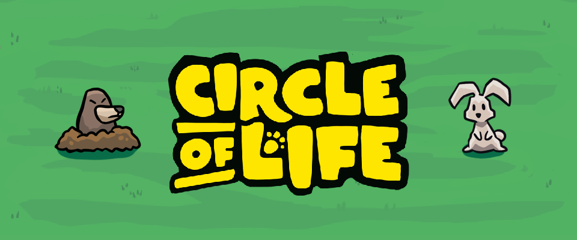

# 🐾 Circle of Life

This game was developed during the **GTMK Game Jam 2025** using the **Godot** game engine.

## License

- The code is licensed under the [**MIT License**](./LICENSE).
- The **Stopbuck** font by **Khurasan** is free for both personal and commercial use.
- **All other assets** (including music and sprites) were created by our team and are **All Rights Reserved**.
